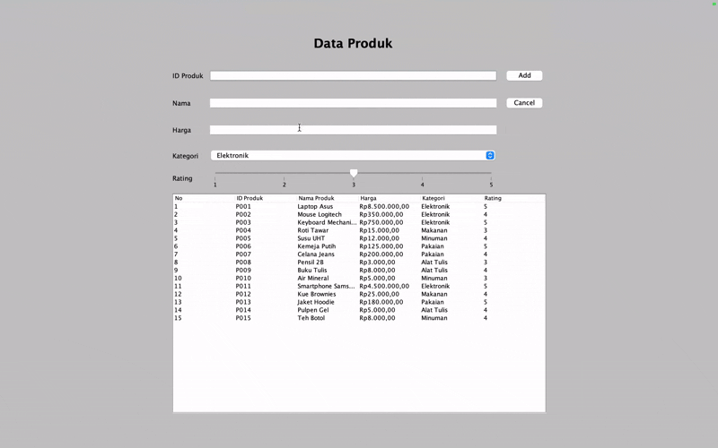
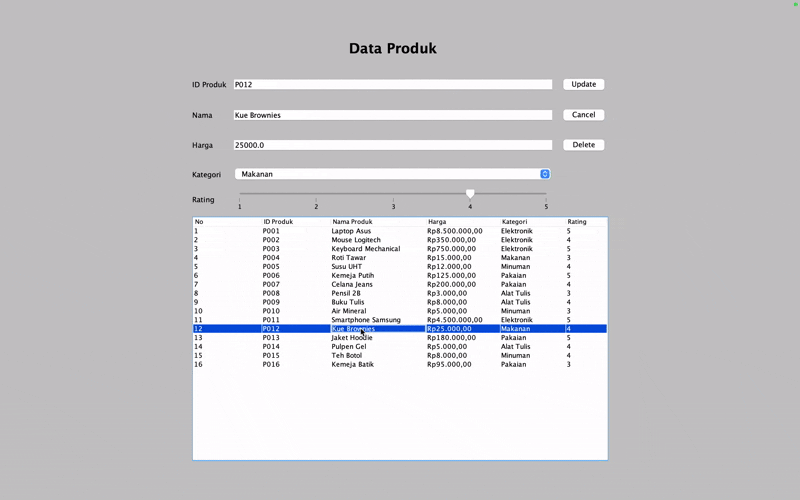
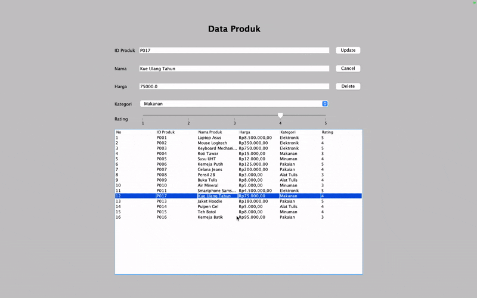

# TP4DPBO2425C1 
TUGAS PRAKTIKUM 4 DPBO SWING GUI

 

# ☝🏻 JANJI 
Saya Putra Bintang Fajar Putra Pamungkas dengan NIM 2405073 mengerjakan Tugas Praktikum 4 dalam mata kuliah Desain dan Pemrograman Berorientasi Objek untuk keberkahanNya maka saya tidak melakukan kecurangan seperti yang telah dispesifikasikan. Aamiin.

 

# 🛠️ DESIGN PROGRAM 
Program ini dibuat menggunakan Java Swing untuk mengelola data produk. Fitur utama meliputi: 
- Create: Menambahkan data produk baru. 
- Read: Menampilkan data produk. 
- Update: Mengedit data produk yang sudah ada. 
- Delete: Menghapus data produk. 

 

## CLASS PADA PROGRAM: 
### 1. Class Product 
Class ini berisi atribut dan method getter/setter. Berikuy atribut-atributnya: 
-  String id
-  String nama
-  double harga
-  String kategori
-  int rating
Method:
- Constructor Product(String id, String nama, double harga, String kategori, int rating)
- Getter/setter
Getter dan Setter untuk setiap atribut

### 2. Class ProductMenu extends JFrame 
Class ini berisi Graphical User Interface (GUI) dari program, berfungsi untuk mengatur GUI, serta method untuk insert, update, dan delete. 

Class ini mengatur tampilan dan logika aplikasi berbasis GUI.
Berfungsi untuk menampilkan form, menampung event handler, serta mengatur data produk dalam bentuk tabel.

<b>Komponen Utama GUI:</b>
- JTextField → untuk input ID, Nama, dan Harga
- JComboBox → untuk memilih Kategori
- JSlider → untuk memberikan Rating (1–5)
- JTable → untuk menampilkan daftar produk
- Tombol Add/Update, Delete, dan Cancel

<b>Fungsi utama dalam class ini:</b>
- insertData() – Menambahkan produk baru ke dalam list
- updateData() – Memperbarui data produk yang dipilih
- deleteData() – Menghapus data produk setelah konfirmasi dialog
- clearForm() – Mengosongkan semua input form
- setTable() – Mengatur isi tabel berdasarkan list produk
- populateList() – Mengisi data awal produk secara default

# ✅ ALUR PROGRAM
### 1. Tampilan Utama
Tampilan utama berisi formulir data produk yang berisi:
- ID Produk
- Nama
- Harga
- Kategori
- Rating
- Tombol aksi Add/Update, Delete, dan Cancel.
Di bawah form terdapat tabel yang menampilkan daftar semua produk.

### 2. Penambahan Data Baru
User dapat menambahkan data baru dengan mengisi form data produk kemudian klik tombol aksi "Add" untuk menyimpan data kedalam tabel.

### 3. Update Data
Saat salah satu baris tabel diklik, data produk akan muncul kembali di form input. 
Tombol "Add" otomatis berubah menjadi "Update", dan tombol "Delete" akan tampil. Setelah itu user dapat mengisi data yang ingin di update. 

### 4. Delete Data
Jika user ingin menghapus salah satu data, klik tombol "Delete" pada data yang dipilih.

Akan muncul konfirmasi dialog:
“Apakah Anda yakin ingin menghapus produk ini?”

Jika memilih Yes, data akan dihapus dari list dan tabel.

### 5. Cancel/Membersihkan form
Klik tombol "Cancel" untuk mengosongkan semua input form.

# ⭐️ KOMPONEN TAMBAHAN (BONUS)
<b>- Rating (BONUS)</b> 
Program ini menambahkan komponen baru berupa JSlider untuk menilai rating produk (1–5).
Nilai rating juga ditampilkan di tabel dan disimpan dalam atribut rating di class Product.
Ini termasuk komponen non–JTextField, sehingga memenuhi kriteria bonus (+20 poin).

# 📸 DOKUMENTASI
## READ

## ADD

## UPDATE

## DELETE

